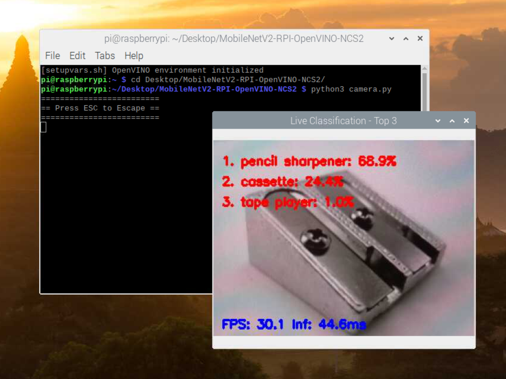

# Run MobileNet V2 on Raspberry Pi with OpenVINO™ Toolkit using Intel® Neural Compute Stick 2

-   Raspberry Pi 3 Model B+
-   Raspbian OS ([Legacy version, 2020-08-24](https://downloads.raspberrypi.org/raspios_armhf/images/raspios_armhf-2020-08-24/))

## Prerequisites

1.  Modify `apt` source, update and upgrade packages.
2.  Install Python3.7, `pip3` and uninstall Python2, etc.
3.  Install `numpy` and `opencv-python`. Refer to the [appendix](#appendix) of this README for wheels.

## Install the OpenVINO™ Toolkit for Raspbian OS Package

This section follows the instructions from the `2021.4/openvino_docs_install_guides_installing_openvino_raspbian.html` document in the [OpenVINO™ Toolkit documentation archives](https://docs.openvino.ai/archives/index.html).

### Download and Install OpenVINO™

From the [OpenVINO™ Toolkit 2021.4 Downloads page](https://storage.openvinotoolkit.org/repositories/openvino/packages/2021.4/), download the version for Raspbian OS: `l_openvino_toolkit_runtime_raspbian_p_2021.4.582.tgz` to the `~/Downloads` folder.

Then run:

```bash
sudo mkdir -p /opt/intel/openvino_2021
sudo tar -xf  ~/Downloads/l_openvino_toolkit_runtime_raspbian_p_2021.4.582.tgz --strip 1 -C /opt/intel/openvino_2021
```

Now the OpenVINO toolkit components are installed. Additional configuration steps are still required. Continue to the next sections to install External Software Dependencies, configure the environment and set up USB rules.

### Install External Software Dependencies

```bash
sudo apt install cmake
```

### Set the Environment Variables

You must update several environment variables before you can compile and run OpenVINO toolkit applications. Run the following script to temporarily set the environment variables:

```bash
source /opt/intel/openvino_2021/bin/setupvars.sh
# Or, to set up the OpenVINO environment variables automatically at each terminal startup, run:
# echo "source /opt/intel/openvino_2021/bin/setupvars.sh" >> ~/.bashrc
# source ~/.bashrc
```

`[setupvars.sh] OpenVINO environment initialized` should be printed.

### Add USB Rules for an Intel® Neural Compute Stick 2 device

This task applies only if you have an Intel® Neural Compute Stick 2 device.

1.  Add the current Linux user to the users group:

    ```bash
    sudo usermod -a -G users "$(whoami)"
    ```
    Log out and log in for it to take effect.
2.  If you didn't modify `.bashrc` to permanently set the environment variables, run `setupvars.sh` again after logging in:
    
    ```bash
    source /opt/intel/openvino_2021/bin/setupvars.sh
    ```
3.  To perform inference on the Intel® Neural Compute Stick 2, install the USB rules running the `install_NCS_udev_rules.sh` script:
    
    ```bash
    sh /opt/intel/openvino_2021/install_dependencies/install_NCS_udev_rules.sh
    ```
    Plug in your Intel® Neural Compute Stick 2.

You are now ready to verify the Inference Engine installation. Run the following script to check the available devices:

```bash
python3 - << 'EOF'
from openvino.inference_engine import IECore
ie = IECore()
print(ie.available_devices)
EOF
```

`['MYRIAD']` should be printed.

## Prepare the MobileNet V2 Model

### Download OpenVINO™ with Model Optimizer

Since the guide `2021.4/openvino_docs_install_guides_installing_openvino_raspbian.html` writes:

> The package **does not include the Model Optimizer**. To convert models to Intermediate Representation (IR), you need to install it separately to your host machine.

So we need another host machine. For instance, **on another Ubuntu machine**, download the OpenVINO™ Toolkit 2021.4 package Ubuntu version `l_openvino_toolkit_dev_ubuntu20_p_2021.4.582.tgz` from the [OpenVINO™ Toolkit 2021.4 Downloads page](https://storage.openvinotoolkit.org/repositories/openvino/packages/2021.4/).

Then rerun all the instructions above to install OpenVINO™ on that Ubuntu machine, but this time using the Ubuntu package. Verify that there's an `mo.py` in the directory `/opt/intel/openvino_2021/deployment_tools/model_optimizer`.

### Download and Convert the MobileNet V2 Model

First, set up a virtual environment (e.g., named `.venv`). Install `torch` (cpu-only is fine), `torchvision`, `onnx`, and `onnxruntime` on your Linux machine:

```bash
source ./.venv/bin/activate
# Furthermore, you can follow the instructions at https://pytorch.org/get-started/locally/
pip3 install torch torchvision --index-url https://download.pytorch.org/whl/cpu
pip3 install onnx onnxruntime
```

Run the following command to export the model to the ONNX format:

```bash
python3 export.py
```

Now there should be a file `mobilenet_v2.onnx` in the current directory.

Next, set up another virtual environment (e.g., named `.onnx`). 

```bash
cd /opt/intel/openvino_2021/deployment_tools/model_optimizer/install_prerequisites
source ./.onnx/bin/activate
install_prerequisites_onnx.sh
```

Run the following command to convert the ONNX model to OpenVINO™ IR format:

```bash
python3 /opt/intel/openvino_2021/deployment_tools/model_optimizer/mo.py \
  --input_model mobilenet_v2.onnx \
  --output_dir . \
  --input_shape [1,3,224,224]
```

-   If you don't add the argument `--input_shape [1,3,224,224]`, then an error would occur:

    ```
    [ ERROR ]  Cannot infer shapes or values for node "node_view".
    [ ERROR ]  Number of elements in input [   0 1280    1    1] and output [np.int64(1), np.int64(1280)] of reshape node node_view mismatch
    [ ERROR ]  
    [ ERROR ]  It can happen due to bug in custom shape infer function <function Reshape.infer at 0x7723ee0d2dc0>.
    [ ERROR ]  Or because the node inputs have incorrect values/shapes.
    [ ERROR ]  Or because input shapes are incorrect (embedded to the model or passed via --input_shape).
    [ ERROR ]  Run Model Optimizer with --log_level=DEBUG for more information.
    [ ERROR ]  Exception occurred during running replacer "REPLACEMENT_ID" (<class 'extensions.middle.PartialInfer.PartialInfer'>): Stopped shape/value propagation at "node_view" node. 
    For more information please refer to Model Optimizer FAQ, question #38. (https://docs.openvinotoolkit.org/latest/openvino_docs_MO_DG_prepare_model_Model_Optimizer_FAQ.html?question=38#question-38)
    ```
-   If you try to transform MobileNet V3 Small ONNX, then an error would occur:
    
    ```
    [ ERROR ]  Cannot infer shapes or values for node "n0".
    [ ERROR ]  There is no registered "infer" function for node "n0" with op = "HardSwish". Please implement this function in the extensions. 
    For more information please refer to Model Optimizer FAQ, question #37. (https://docs.openvinotoolkit.org/latest/openvino_docs_MO_DG_prepare_model_Model_Optimizer_FAQ.html?question=37#question-37)
    [ ERROR ]  
    [ ERROR ]  It can happen due to bug in custom shape infer function <UNKNOWN>.
    [ ERROR ]  Or because the node inputs have incorrect values/shapes.
    [ ERROR ]  Or because input shapes are incorrect (embedded to the model or passed via --input_shape).
    [ ERROR ]  Run Model Optimizer with --log_level=DEBUG for more information.
    [ ERROR ]  Exception occurred during running replacer "REPLACEMENT_ID" (<class 'extensions.middle.PartialInfer.PartialInfer'>): Stopped shape/value propagation at "n0" node. 
    For more information please refer to Model Optimizer FAQ, question #38. (https://docs.openvinotoolkit.org/latest/openvino_docs_MO_DG_prepare_model_Model_Optimizer_FAQ.html?question=38#question-38)
    ```

Now there should be two files `mobilenet_v2.xml` and `mobilenet_v2.bin` in the current directory. (Maybe there's also a `mobilenet_v2.mapping` file, but it's not needed.)

Finally, copy these two files to your Raspberry Pi.

## Run Inference

Run the following command to test the model on validation set:

```bash
python3 main.py
```

Run the following command to start real-time inference from the camera:

```bash
python3 camera.py
```

## Results



## Appendix

In the release page of this project, there are several assets for your convenience:

1.  Validation folder, in which contains images for accuracy testing:
    -   `validation.zip`
2.  Demo folder, in which contains images for real-time inference testing:
    -   `demo.zip`
3.  Label mapping file:
    -   `label_mapping.json`
4.  OpenVINO™ Toolkit packages:
    -   `l_openvino_toolkit_runtime_raspbian_p_2021.4.582.tgz`
    -   `l_openvino_toolkit_dev_ubuntu20_p_2021.4.582.tgz`
5.  OpenVINO™ IR model files:
    -   `mobilenet_v2.xml`
    -   `mobilenet_v2.bin`
6.  Wheels for required Python packages on Raspbian OS:
    -   `numpy-1.21.4-cp37-cp37m-linux_armv7l.whl`
    -   `opencv_python-4.7.0.72-cp37-cp37m-linux_armv7l`
7.  Installation guide for OpenVINO™ Toolkit 2021.4:
    -    `2021.4/`

In conclusion, the project folder has the following structure:

```

```
